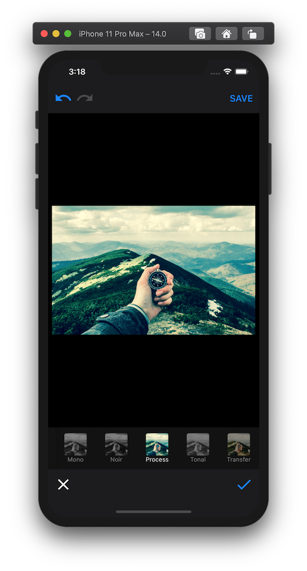
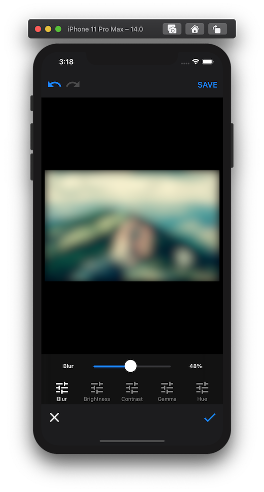
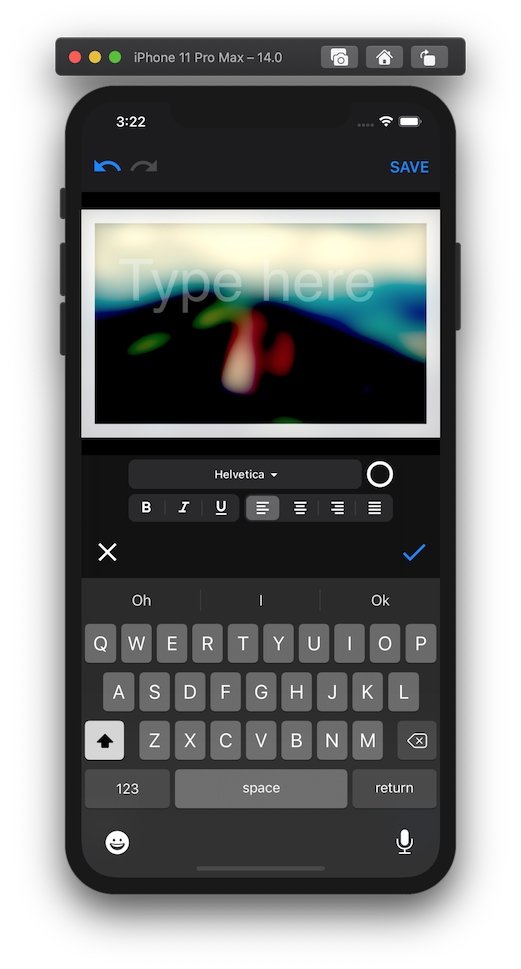
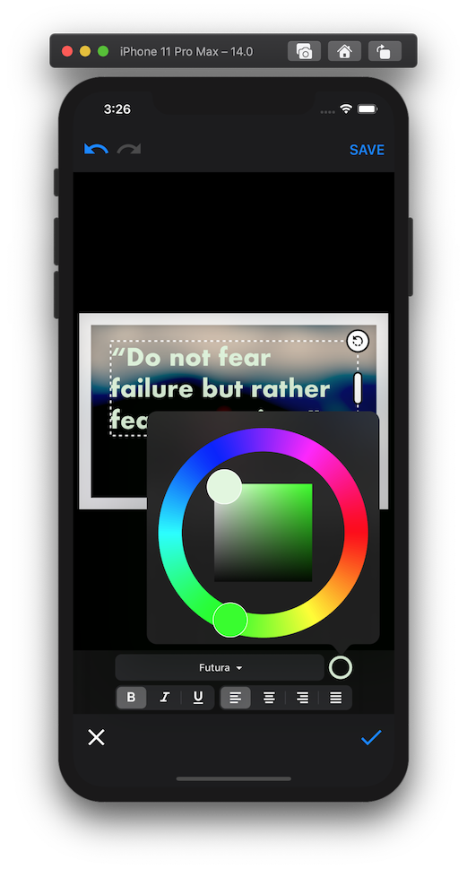

# Transformations UI

Filestack's [Transformations UI](https://www.filestack.com/docs/transformations/ui/) implementation for iOS and iPadOS.

## Requirements

* Xcode 12+
* Swift 4.2+ / Objective-C
* iOS 11.0+ / iPadOS 13.0+

## Installation

**Transformations UI** for iOS is available in 2 different flavors:

1. Version with **Standard Modules**.
2. Version with **Premium Modules** (requires a **Filestack API key** with permission to use this feature.)

The installation procedure will be different depending on what flavor you would like to install.

### 1. Installing Transformations UI with Standard Modules

- Add `https://github.com/filestack/transformations-ui-ios.git` as a [Swift Package Manager](https://swift.org/package-manager/) dependency to your project.

- Make sure that `TransformationsUI.framework` is set to **Embed & Sign** in your app's target.

### 2. Installing Transformations UI with Premium Modules

- Go to `https://github.com/filestack/transformations-ui-ios/releases` and download the latest binary release available.

- Unzip the file you just downloaded and select everything inside it from the Finder.

- Drag & drop your selection into **Dependencies** making sure that **Copy items if needed** is checked.

- Select your target, expand **Frameworks, Libraries, and Embedded Content** and set all the added frameworks to **Embed & Sign**.

## Usage

### Basic Usage

1. Import `TransformationsUI`

    ```swift
    import TransformationsUI
    ```

2. Instantiate `TransformationsUI` and set delegate

    ```swift
    let transformationsUI = TransformationsUI()
    transformationsUI.delegate = self
    ```

3. Add conformance to `TransformationsUIDelegate`

    ```swift
    extension ViewController: TransformationsUIDelegate {
        func editorDismissed(with image: UIImage?) {
            if let image = image {
                // TODO: Do something with resulting image...
            }
        }
    }
    ```

4. Present `TransformationsUI` view controller

    ```swift
    if let editorVC = transformationsUI.editor(with: image) {
        editorVC.modalPresentationStyle = .fullScreen
        present(editorVC, animated: true)
    }
    ```

### Using Standard or Premium Modules

A newly instantiated `TransformationsUI` object is configured to use **Standard Modules** by default.

In order to use **Premium Modules** instead, first make sure you have downloaded and installed the binary release of `TransformationsUI` into your project as explained above, and then follow these steps:

1. Import `TransformationsUIShared` and `TransformationsUIPremiumAddOns`

    ```swift
    import TransformationsUI
    import TransformationsUIShared /* newly added */
    import TransformationsUIPremiumAddOns /* newly added */
    ```

2. Get your **Filestack API key** ready, you will need it for next step.

3. Instantiate `TransformationsUI` using a custom `Config` object

    ```swift
    let modules: TransformationsUIShared.EditorModules

    do {
        let premiumModules = try PremiumModules(apiKey: "YOUR-API-KEY-HERE")

        modules = premiumModules
    } catch {
        // Unable to instantiate `PremiumModules`.
        //
        // You may want to double-check that your Filestack account has permissions
        // to use Transformations UI for the API key you have used above.
        //
        // Falling back to `StandardModules`.
        modules = StandardModules()
    }

    let config = Config(modules: modules)
    let transformationsUI = TransformationsUI(with: config)
    ```

After that, you may follow the same steps as in the previous section (e.g., set and implement delegate, present view controller, etc.)

## Modules Features

This is the current list of features available per module depending on chosen editor modules family:

### Standard Modules

#### Transform
- Rotate (clockwise)
- Crop
    - Rect
    - Circle

### Premium Modules

#### Transform
- Flip
- Flop
- Rotate
    - Clockwise
    - Anticlockwise
- Crop
    - Rect
        - Freeform
        - Fixed
        - Custom
    - Circle
- Resize
    - Free/Locked ratio

#### Filters
- Chrome, Fade, Instant, Mono, Noir, Process, Tonal, Transfer

#### Adjustments
- Blur, Brightness, Contrast, Gamma (per RGB component), Hue

#### Text
- Font Family
- Text Color
- Text Style
    - bold, italic, underline
- Text Alignment:
    - left, center, right, justify

### Sticker
- Stickers

#### Border
- Color
- Width
- Transparency

## Enabling or Disabling Modules

Modules may be enabled or disabled programmatically. Let's see an example:

1. Defining the available premium modules.

    ```swift
    let premiumModules = try PremiumModules(apiKey: "YOUR-API-KEY-HERE")

    premiumModules.all = [
        premiumModules.transform,
        premiumModules.filters,
        premiumModules.adjustments
    ]
    ```

## Enabling or Disabling Module Features

Module features may be enabled or disabled programmatically. Let's see a few examples:

1. When using `StandardModules`, you want to allow circle cropping but disallow rect cropping.

    ```swift
    let standardModules = StandardModules()

    standardModules.transform.cropCommands = [
        StandardModules.Transform.Commands.Crop(type: .none),
        StandardModules.Transform.Commands.Crop(type: .circle)
    ]
    ```

2. When using `StandardModules`, you don't want any extra commands (e.g. rotation) to be available.

    ```swift
    let standardModules = StandardModules()

    standardModules.transform.extraCommands = []
    ```

3. When using `PremiumModules`, you want to define custom crop modes.

    ```swift
    let premiumModules = try PremiumModules(apiKey: "YOUR-API-KEY-HERE")

    // Keep original ratio
    premiumModules.transform.cropCommands.append(
        PremiumModules.Transform.Commands.Crop(type: .rect, aspectRatio: .original)
    )

    // Keep 16:9 ratio
    premiumModules.transform.cropCommands.append(
        PremiumModules.Transform.Commands.Crop(type: .rect, aspectRatio: .custom(CGSize(width: 16, height: 9)))
    )
    ```

4. When using `PremiumModules`, you want to redefine the available filters in filters module.
    ```swift
    let premiumModules = try PremiumModules(apiKey: "YOUR-API-KEY-HERE")

    premiumModules.filters.commands = [
        PremiumModules.Filters.Commands.Filter(type: .chrome),
        PremiumModules.Filters.Commands.Filter(type: .process),
        PremiumModules.Filters.Commands.Filter(type: .instant)
    ]
    ```

5. When using `PremiumModules`, you want to add extra available font families to text module.

    ```swift
    let premiumModules = try PremiumModules(apiKey: "YOUR-API-KEY-HERE")

    premiumModules.text.availableFontFamilies.append(contentsOf: ["Optima Regular", "Symbol"])
    ```

    Or you may want to replace available font families completely:

    ```swift
    premiumModules.text.availableFontFamilies = ["Optima Regular", "Symbol"]
    ```

To discover other module features that may be configured, enabled or disabled, try Xcode's autocompletion with your `StandardModules` or `PremiumModules` objects.

## Screenshots

|  |  |  |
|---|---|---|
|  |  |  |

## Demo

Check the [demos](https://github.com/filestack/transformations-ui-demo-ios) showcasing using **Transformations UI** with either **Standard** or **Premium modules**.

## Versioning

Transformations UI follows the [Semantic Versioning](http://semver.org/).

## Issues

If you have problems, please create a [Github Issue](https://github.com/filestack/transformations-ui-ios/issues).

## Credits

Thank you to all the [contributors](https://github.com/filestack/transformations-ui-ios/graphs/contributors).
